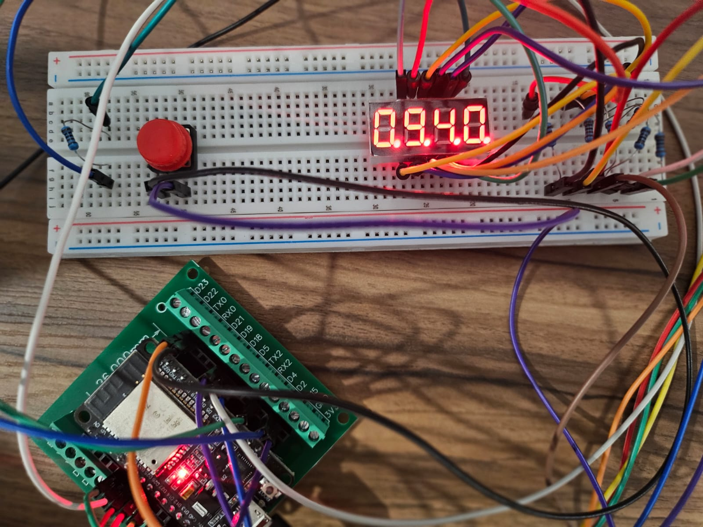

# ESP32 WiFi Digital Clock

## Circuit Photo

Final breadboard prototype of the ESP32 WiFi clock.



A custom-built digital clock using an ESP32 and a 4-digit 7-segment display.

The clock connects to WiFi and synchronizes time using an online NTP server, so the displayed time stays accurate automatically. A push button allows switching between multiple display modes including time, date, and year.

---

## Video Demo

[Watch the project demo here](https://youtu.be/IMkg9wuaW94?si=IP50JV6R_8-KQYXV)

---

## Features

- WiFi-based time synchronization
- Real-time clock using NTP
- Multiplexed 4-digit 7-segment display
- Button-controlled display modes
- Displays:
  - current time
  - current date
  - current year
- Built entirely on a breadboard using jumper wires and resistors

---

## Project Goal

The goal of this project was to learn more about embedded systems, display multiplexing, hardware debugging, and WiFi communication using ESP32.

---

## Components Used

- ESP32 Dev Board
- 4-digit 7-segment display
- Push button
- Breadboard
- Jumper wires
- 7 resistors
- USB power supply

---

## Pin Configuration

| Component | ESP32 Pin |
|---|---|
| Segment A | GPIO 13 |
| Segment B | GPIO 15 |
| Segment C | GPIO 27 |
| Segment D | GPIO 26 |
| Segment E | GPIO 25 |
| Segment F | GPIO 33 |
| Segment G | GPIO 32 |
| Decimal Point | GPIO 23 |
| Digit 1 | GPIO 18 |
| Digit 2 | GPIO 19 |
| Digit 3 | GPIO 5 |
| Digit 4 | GPIO 4 |
| Button | GPIO 22 |

---

## How It Works

When powered on, the ESP32 connects to WiFi and pulls accurate local time from an online NTP server using the built-in time library.

The display uses multiplexing, where each digit is rapidly activated one at a time. Because the refresh speed is fast enough, all four digits appear to be lit at the same time to the human eye.

A push button cycles between three display modes:

1. Time
2. Date
3. Year

The displayed values are updated every second while the multiplexing system runs continuously inside the main loop.

---

## Development Process

This project went through multiple hardware and software revisions before reaching the final version.

### Button Debugging

Earlier, I tried using GPIO 12 as the digital input pin. However, this caused inconsistent button behavior due to GPIO selection issues and floating input states. This was fixed by switching to GPIO 22 and using `INPUT_PULLUP`.

### Resistor Testing

I initially tested using only four resistors connected to the digit control pins. However, this caused unstable display behavior and inconsistent brightness.

The final version uses resistors on the segment lines instead, which improved display stability and reliability.

### OLED Display Experiment

I also experimented with integrating a 4-pin OLED display alongside the 7-segment display. During testing, the OLED produced unstable or glitched output.

Possible causes investigated included:
- timing conflicts
- power limitations
- communication interference
- multiplexing refresh behavior

Although the OLED integration was not successful, the experiment helped me better understand debugging and hardware limitations in embedded systems.

---

## Challenges Faced

Some challenges encountered during development included:

- incorrect GPIO behavior
- display flickering
- button debounce issues
- multiplexing timing
- unstable OLED integration
- breadboard rewiring and troubleshooting

These problems required multiple rounds of testing, debugging, and redesign before the final version worked consistently.

---

## What I Learned

Through this project, I learned more about:

- ESP32 WiFi communication
- NTP time synchronization
- multiplexed displays
- GPIO behavior
- embedded programming
- hardware debugging
- breadboard prototyping
- iterative engineering design

---

## Future Improvements

Possible future upgrades for the project:

- RTC backup module
- automatic brightness adjustment
- alarm functionality
- custom PCB design
- 3D printed enclosure
- web interface for settings
- weather or temperature integration

---

## Code

The full source code is included in this repository:

```text
esp32_sync_clock.ino
```

---

## Author

Built by Marvellino Nata
