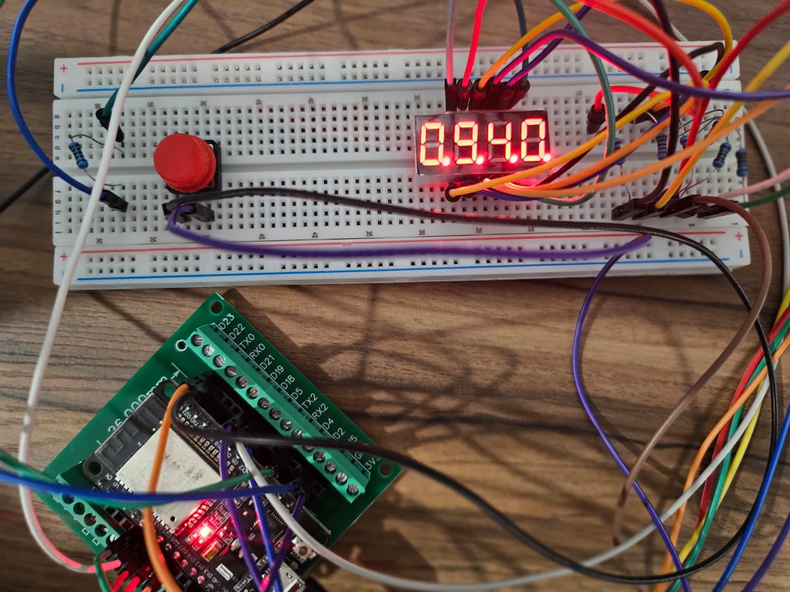

# ESP32 WiFi Clock

I made a digital clock using an ESP32 and a 4-digit 7-segment display. It connects to WiFi and gets the time from the internet, so it's always correct. There's a button to switch between time, date, and year.

[Watch the demo here](https://youtu.be/IMkg9wuaW94?si=IP50JV6R_8-KQYXV)

---

## What it does

- Connects to WiFi and syncs time automatically
- Shows time, date, or year on a 4-digit display
- Button cycles through the three modes
- Runs on a breadboard with jumper wires and resistors

---

## Parts I used

- ESP32 dev board
- 4-digit 7-segment display
- Push button
- Breadboard and jumper wires
- 7 resistors
- USB power supply

---

## Pin connections

| Part | ESP32 Pin |
|---|---|
| Segment A | GPIO 13 |
| Segment B | GPIO 15 |
| Segment C | GPIO 27 |
| Segment D | GPIO 26 |
| Segment E | GPIO 25 |
| Segment F | GPIO 33 |
| Segment G | GPIO 32 |
| Decimal Point | GPIO 23 |
| Digit 1 | GPIO 18 |
| Digit 2 | GPIO 19 |
| Digit 3 | GPIO 5 |
| Digit 4 | GPIO 4 |
| Button | GPIO 22 |

---

## How it works

When it turns on, the ESP32 connects to WiFi and grabs the time from an NTP server. The display uses multiplexing, which means it lights up one digit at a time really fast. Because it's so fast, your eyes see all four digits at once.

The button switches between time, date, and year. The time updates every second in the main loop.

---

## Problems I ran into

- **Button was acting weird.** I first used GPIO 12, but it gave inconsistent readings. Switched to GPIO 22 and used `INPUT_PULLUP`. That fixed it.
- **Display was unstable with resistors on digit pins.** I originally put resistors on the digit control pins. The brightness was all over the place. Moved them to the segment lines instead, and it got much better.
- **Tried adding an OLED, but it glitched.** I wanted to add a small OLED screen alongside the 7-segment. It kept showing garbage. I think it was timing or power issues. Never got it working, but I learned a lot trying.
- **Display flickered sometimes.** Had to adjust the multiplexing speed a bit. It's still not perfect but good enough.
- **Breadboard wiring was a mess.** Lots of rewiring and troubleshooting. Normal stuff.

---

## What I learned

- How to use WiFi and NTP on ESP32
- How multiplexing works on 7-segment displays
- GPIO pins can be picky (looking at you, GPIO 12)
- Debugging hardware takes patience
- Breadboards are great but messy

---

## Future ideas

- Add a real-time clock module so it works without WiFi
- Auto brightness
- Alarm
- Custom PCB
- 3D printed case
- Maybe a web interface
- Weather display

---

## Code

The code is in this repo: `esp32_sync_clock.ino`

---

## Author

Built by Marvellino Nata